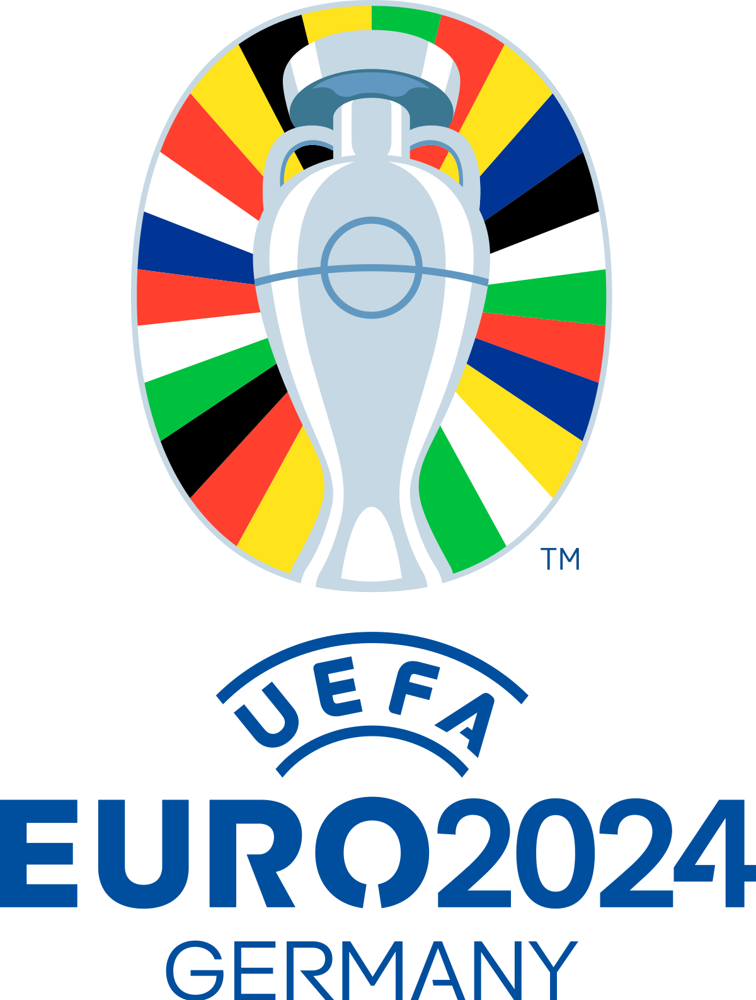

# Exercise: DJANGO/EURO 2024

*Disclaimer: this introduction was mostly generated by a good friend.*

In this hands-on project, students will dive into the world of Django, by creating a dynamic and engaging web application centered around EURO 2024 ([football](https://en.wikipedia.org/wiki/UEFA_Euro_2024?useskin=vector))) that takes place from 14 June to 14 July. 

Get ready to unleash your creativity, learn essential Django concepts, and craft a platform where fans can stay updated with the latest scores, fixtures, and team information. Let's kick off this exciting journey into the realm of sports web development!

# Exercise

Create an app that allows you to view public data about the EURO 2024 championship. (poules, standings, locations, matches, teams, players, ...) You can decide what the app focuses on.
Make sure that you create the right models and to link them together as in a well-structured database.

You should be able to use the Django admin module to add or alter data.

Furthermore, add a login. When a user is logged in, some private functionality must be provided only for logged in users.
This can be anything:
* [EASY] Pick a favorite team.
* [MEDIUM] Allow users to predict a score for every match.
* [HARD] Implement a tournament predictor. Several similar apps can be found, e.g. the one on [The Telegraph](https://www.telegraph.co.uk/football/euro-2024-predictor-simulator-every-game/).

# Gettin' jiggy with it

1. Clone the repository
2. Navigate to the folder with the clone and run `docker-compose up` (assuming you have Docker installed on your system)
3. Once the container is running, you should be able to visit the Django web app on [http://localhost:7777/](http://localhost:7777/)
4. The `code` folder is mounted as a volume, so you can start coding on your host system. The Django app should update automatically when you change something.

Good luck!
